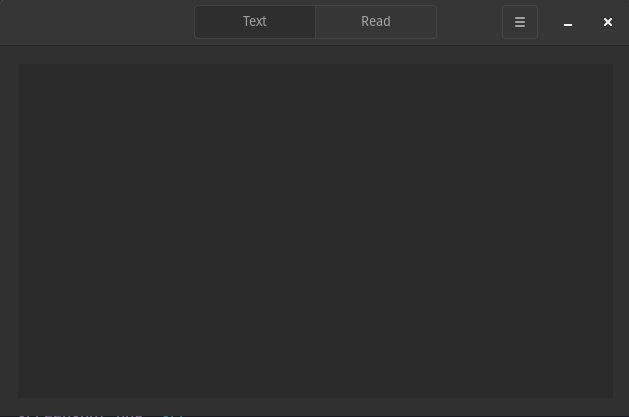

#  Spedread

GTK speed reading software: Read like a speedrunner!

This program will show one word at a time rapidly to allow focusing on the general idea rather than single words
along with less eye movements

## Features



- International
- Play, pause, next word & previous word
- Control the speed at which words are shown

## Install

This will require a valid Vala compiler and the GTK4 development files:

```sh
meson build --buildtype release
cd build
ninja
sudo ninja install
```
