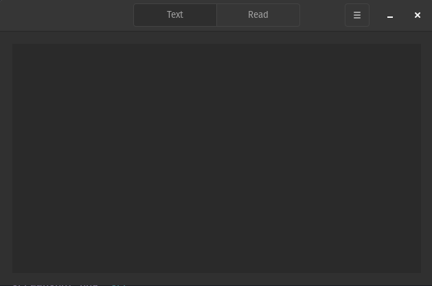

#  Spedread

**GTK Speed Reading Software: Read Like a Speedrunner! ⚡**

Spedread is a powerful speed reading application that displays one word at a time in rapid succession, helping you focus on the overall meaning rather than individual words while reducing eye movement fatigue.

---

## ✨ Features



🌍 **International Support** - Read in multiple languages  
⏯️ **Full Playback Control** - Play, pause, next word & previous word navigation  
🎯 **Customizable Speed** - Adjust reading speed to match your comfort level  
🎨 **Modern GTK4 Interface** - Clean, intuitive design built with libadwaita  

---

## 📦 Installation Options

### 🏪 Flatpak (Recommended)
Get Spedread from Flathub for the best cross-distribution experience:

<a href='https://flathub.org/apps/details/com.github.Darazaki.Spedread'>
    
</a>

### 📦 Snap Store
Available on the Canonical Snap Store:

<a href='https://snapcraft.io/spedread'>
    
</a>

> **Note:** The snap package is originally created and maintained by [@sameersharma2006](https://github.com/sameersharma2006)

### 🏗️ Arch User Repository (AUR)
Two packages are available for Arch Linux users:

- **[spedread](https://aur.archlinux.org/packages/spedread)** - Stable release
- **[spedread-git](https://aur.archlinux.org/packages/spedread-git)** - Latest development version

Both packages are maintained by Igor Dyatlov and the project maintainer. Please report packaging issues directly on the AUR.

---

## 🔧 Build from Source

### Native Installation

**Prerequisites:**
- Valid Vala compiler
- GTK4 development files
- libadwaita development files

```bash
# Clone the repository
git clone https://github.com/Darazaki/Spedread spedread
cd spedread

# Configure the build
meson build --buildtype=release --prefix=/usr
cd build

# Build and install
ninja
sudo ninja install
```

**Uninstalling:**
```bash
# From the build/ directory
sudo ninja uninstall
```

### Flatpak Development Build

**Prerequisites:**
- `flatpak-builder` command
- `appstream-compose` command  
- `org.gnome.Sdk` Flatpak package (version 48)

```bash
# Clone and build
git clone https://github.com/Darazaki/Spedread spedread
cd spedread
dev-scripts/build.sh --install
```

The application will be installed as a Flatpak and can be managed through your system's Flatpak tools.

---

## 🤝 Contributing

We welcome contributions! Feel free to:
- Report bugs and suggest features
- Submit pull requests
- Help with translations
- Improve documentation

---

## 📄 License

This project is open source. Check the repository for license details.

---

<div align="center">

**Made with ❤️ for speed reading enthusiasts**

[Report Bug](https://github.com/Darazaki/Spedread/issues) • [Request Feature](https://github.com/Darazaki/Spedread/issues) • [View Source](https://github.com/Darazaki/Spedread)

</div>
